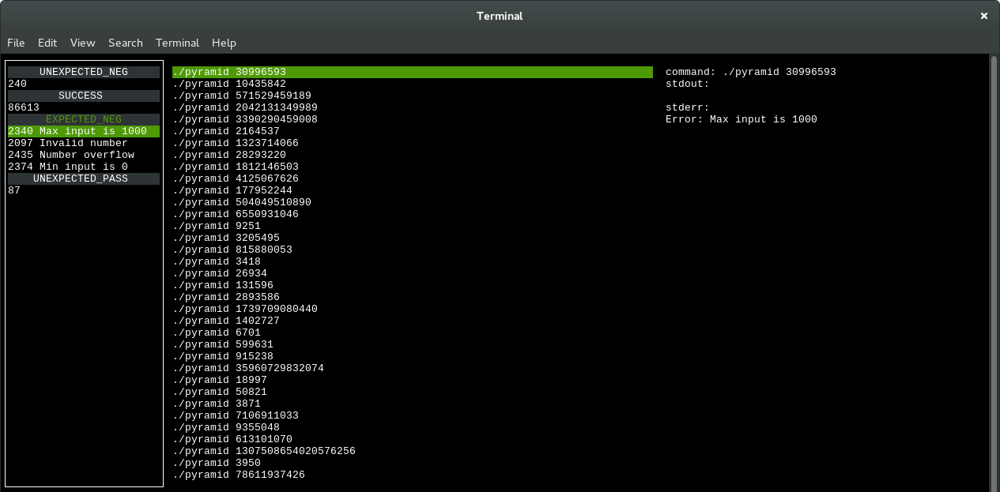

===============
Getting Started
===============

Installing DICE
===============

DICE is currently in experimental stage and not ready for release yet. So
easy-install or pip way of installation is not available now. The only way to install DICE is from the source code.

Install from Git Source
-----------------------

To install DICE from git repository, clone the source code to local first::

    git clone https://github.com/Hao-Liu/dice
    cd dice

Then install dependencies from pip::

    sudo pip install -r requirements.txt

Install DICE::

    sudo python setup.py install

Using DICE
==========

Example Project
---------------

Build the example binary from source::

    cd examples/pyramid
    gcc pyramid.c -o pyramid

Run DICE on the example project::

    dice

This will open a ncurses TUI shows the statistics of results by generating the
option randomly.

The left panel is a **stat panel** shows the stat of error message patterns
categorized by the exit status and whether error message matches expectation
defined in the constraint file.

The central panel is a **list panel** lists recent called command lines matches
the error message pattern selecting in the **stat panel**.

The right panel is a **detail panel** show the detailed information of the
selected command in **list panel** includes command line, standard output and
standard error.

The follow key press allowing navigation through the panels.

+-----+------------------------------+
| Key | Function                     |
+=====+==============================+
| TAB | Toggle current working panel |
+-----+------------------------------+
| Q   | Exit DICE                    |
+-----+------------------------------+
| P   | Pause/Resume execution       |
+-----+------------------------------+
| J   | Select next item             |
+-----+------------------------------+
| K   | Select previous item         |
+-----+------------------------------+
| M   | Merge stat by regex pattern  |
+-----+------------------------------+
| ^W  | Save current input           |
+-----+------------------------------+
| ^D  | Cancel current input         |
+-----+------------------------------+

Create a custom Project (Implementing)
--------------------------------------

